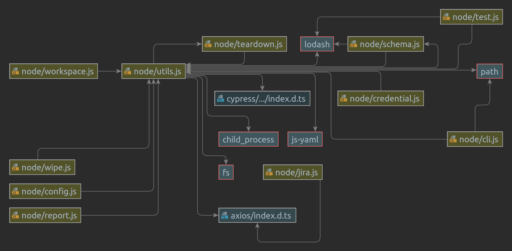

# Cypress Runner

Tool to orchestrate Cypress tests at VTEX.

## Functionalities

- Create dynamic workspace
- Orchestrate tests dependency
- Orchestrate tests that can run in parallel
- Orchestrate witch tests will be reported to Cypress Dashboard
- Wipe data from tests on MasterData if needed
- Tear down

## How to use

TODO

## Architecture

